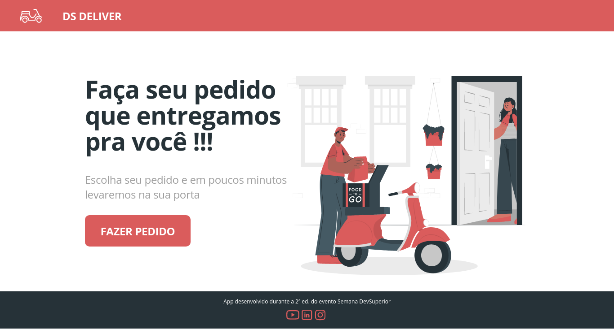
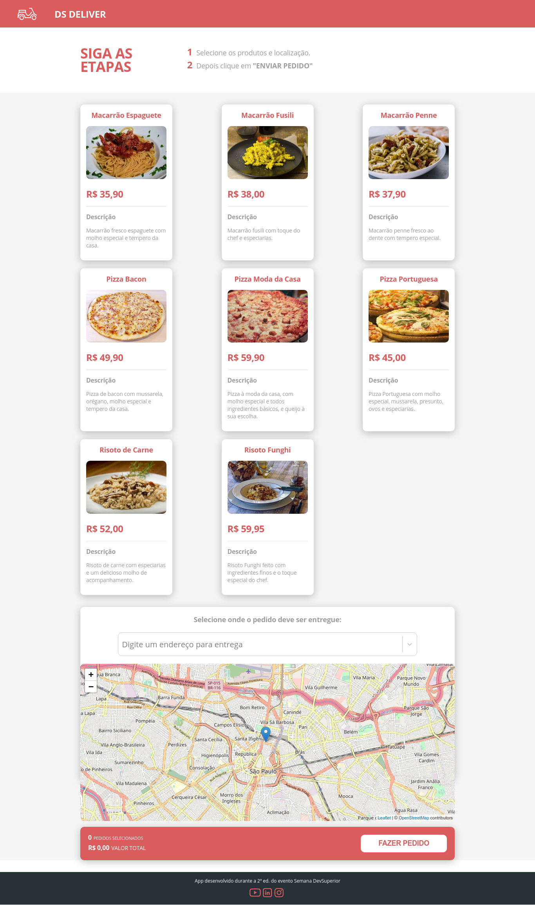
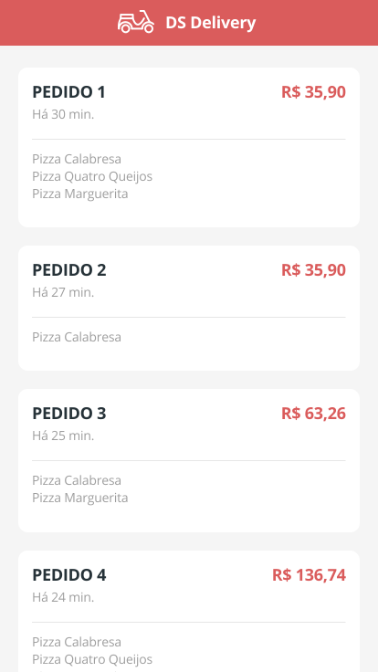
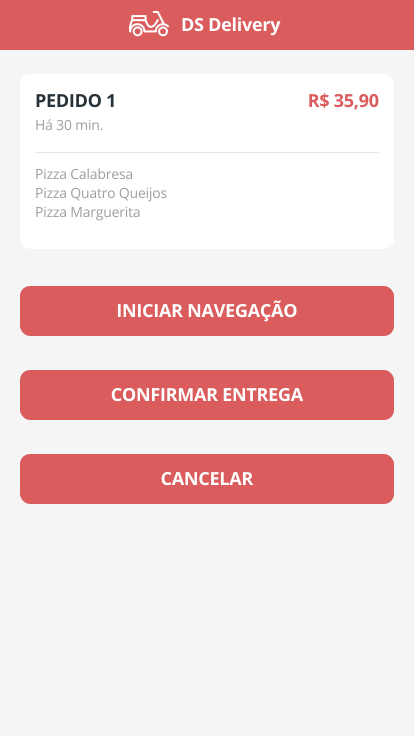

<p align=center>
  
</p>

<h3 align="center">
  <a href="#-sobre">Sobre</a>&nbsp;|&nbsp;
  <a href="#-deploy-online">Deploy online</a>&nbsp;|&nbsp;
  <a href="#-tecnologias-utilizadas">Tecnologias</a>&nbsp;|&nbsp;
  <a href="#-imagens-do-sistema">Imagens do sistema</a>&nbsp;|&nbsp;
  <a href="#-como-usar">Como usar</a>&nbsp;|&nbsp; 
</h3>

## 🗒 Sobre

O **dsDeliver** é uma aplicação que foi desenvolvido durante o evento DevSuperior, sendo uma aplicação web de entrega de pedidos.

<p align=center>
  
</p>

## 🛠 Deploy online
Para testar a aplicação basta clicar [aqui](https://dsdelivery-jonathan.netlify.app/).

## 🚀 Tecnologias Utilizadas

  * [Java Spring Boot](https://spring.io/projects/spring-boot)
  * [ReactJS](https://pt-br.reactjs.org)
  * [Axios](https://github.com/axios/axios)
  * [TypeScript](https://www.typescriptlang.org/)
  * [Heroku](https://www.heroku.com/)
  * [Netlify](https://www.netlify.com/)
  
## 🖼 Imagens do sistema

**WEB**



**WEB**
<p align="center">
  
  
  
</p>

## 📦 Como usar

```bash

  #Clonar o repositório
  $ git clone https://github.com/JonathanKBP/dsdeliver-sds2.git

  # Instalar as dependências NPM
  $ npm install 

  # Inciar o projeto
  $ npm start

```

<p align=center> Desenvolvido por Jonathan Kevin 💻 </p>
